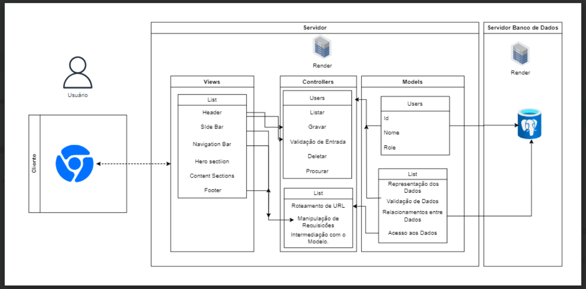

# Diagrama de arquitetura - Aplicação Web

  

O modelo apresentado na imagem é um diagrama que descreve a arquitetura MVC (Model-View-Controller) de uma aplicação web. Neste modelo, a aplicação é dividida em três componentes principais, cada um com suas próprias responsabilidades:

**Usuário**
- O processo começa com o usuário interagindo com a interface de usuário através de um cliente (navegador web, por exemplo).

**View (Visões)**
- As **Views** são responsáveis por apresentar os dados ao usuário. Elas definem como os dados serão exibidos e podem incluir elementos como:
  - **Header**: Cabeçalho da página com logotipo e menu de navegação.
  - **Sidebar**: Barra lateral para links e informações adicionais.
  - **Navigation Bar**: Barra de navegação para acesso a diferentes seções do site.
  - **Hero Section**: Área de destaque na página inicial para atrair a atenção do usuário.
  - **Content Sections**: Seções de conteúdo da página.
  - **Footer**: Rodapé da página com informações adicionais e direitos autorais.

**Controller (Controladores)**
- Os **Controladores** processam as interações do usuário, manipulando os dados que o usuário insere ou solicita. As funções típicas incluem:
  - **Listar**: Exibir uma lista de itens.
  - **Gravar**: Salvar novos dados ou alterações.
  - **Deletar**: Remover dados existentes.
  - **Procurar**: Encontrar dados específicos.
  - **Validação de Entrada**: Verificar a correção dos dados de entrada.
  - **Manipulação de Requisições**: Gerir solicitações HTTP.
  - **Roteamento de URL**: Direcionar solicitações para os controladores apropriados.
  - **Intermediação com o Modelo**: Comunicar com o model para obter e enviar dados.

**Model (Modelos)**
- Os **Modelos** são a representação dos dados da aplicação e o coração da lógica de negócios. Eles podem incluir:
  - **Id, Nome, Role**: Identificadores e atributos dos usuários.
  - **Validação de Dados**: Garantir que os dados são corretos antes de serem processados ou armazenados.
  - **Relacionamentos entre Dados**: Como os dados estão conectados (ex.: usuários e suas postagens).
  - **Acesso aos Dados**: Interagir com o banco de dados para CRUD (criar, ler, atualizar, deletar).

**Servidor e Servidor Banco de Dados**
- O **Servidor** é onde a aplicação é hospedada e gerida, e é responsável pelo processamento do backend e renderização das Views.
- O **Servidor Banco de Dados** é onde os dados são armazenados e gerenciados. O model interage com ele para realizar operações de dados.

Esta arquitetura promove uma separação clara de responsabilidades, facilitando a manutenção e a escalabilidade da aplicação. Cada parte do MVC opera independentemente, mas se comunica de maneira coordenada para fornecer uma experiência de usuário fluida e eficiente.